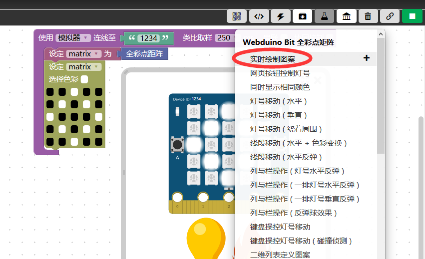
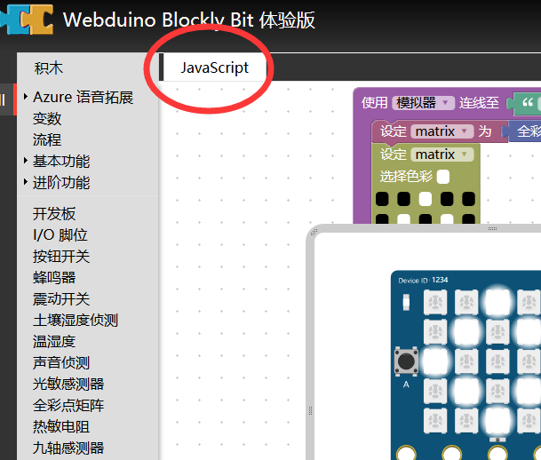
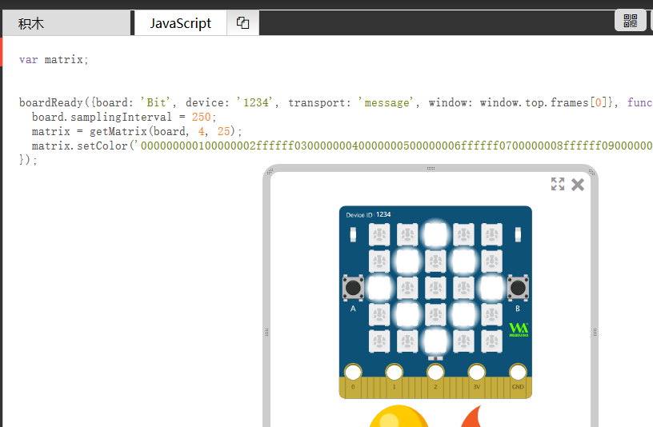

什么是 Blockly ？
=====================================================

所谓的 Blockly 积木编程实际上都是指 `Google Blockly <https://developers.google.cn/blockly/>`_ 的工具，开发者都应该先到这个网站去好好看过一遍，了解一下再进行开发。

但在这里就用一些 Webduino Blockly 的开发示例带领入门，但并不是教你如何开发 Webduino Blockly 网站，而是开发 Blockly 积木。

认识 Webduino Blockly 
----------------------------------------

Blockly 最佳实践语言是 JavaScript 环境，如今配合 HTML5 的飞速发展，不难想象它可以轻松的让人开发出成果，快速产生成就感。

Webduino Blockly 使用的是标准的 Blockly 环境，它所用的 Blockly 生成的是 JavaScript 代码，所以可以直接在浏览器容器上运行看到效果。

在这里 `Webduino Blockly <https://bit.webduino.com.cn/blockly/?lang=zh-hans>`_ 直接导入开发的积木，不需要去部署服务器，也不需要去看如何修改服务器源码，它本身就已经提供了插件开发接口。

.. Hint::

    开发 Webduino Blockly 积木不需要像 Scratch3 一样在服务器源码中添加自定义积木代码。

应该如何开始？
----------------------------------------

.. Hint::

    请先具备 `HTML5 <https://www.runoob.com/html/html-tutorial.html>`_ \ `JavaScript <https://www.runoob.com/js/js-tutorial.html>`_  的编程基础。

不妨先体验一下 Webduino Blockly ，这不同于平时用的教育版，可以作为开发环境所用。

点此进入 `在 BPI-BIT 上显示实时图案 <https://bit.webduino.com.cn/blockly/#qZzEn0JaL1>`_ 的基础示例，当然你也可以看到更多的示例，如下图。

当你进入上述示例网站后，点击右上角即可运行程序，此时你注意一下左侧的工具栏。

点此 JavaScript 的按钮，你就会看到关于 Blockly 代码的生成。

事实上，这就是 Blockly 的本质，积木只是代码的另一种表现形式。

同样的，作为开发者给到用户的也就是这样的一个体验效果，所见即所得，那么将如何做到这个效果呢？

继续往下看，下面就会做一个指导性说明，有关于开发流程的说明。

开发的流程是？
--------------------

所以我们要如何开发的流程应该尽可能满足如下形式：

1. 我想做什么功能？

2. 这功能的积木应该长怎样?（设计积木外观）

3. 如何将设计的积木运行起来？

4. 如何实现积木的功能？

5. 怎样测试我设计积木？

6. 别人要如何复现？

基于类似如上的流程，就是我们接下来主要讲的内容了。
