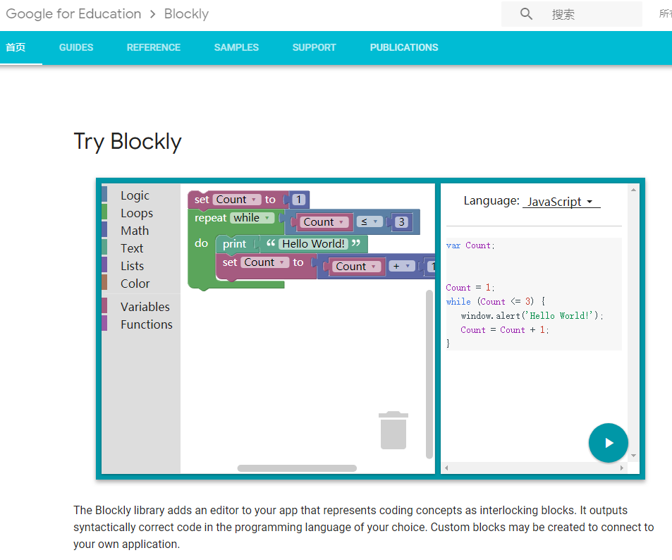

Blockly 是什么？
=====================================================

所谓的 Blockly 积木编程实际上都是指 `Google Blockly <https://developers.google.cn/blockly/>`_ 的工具，开发者都应该先到这个网站去好好看过一遍，了解一下再进行开发。

可以在此体验 `Try Blockly <https://developers.google.cn/blockly/>`_ 的积木运行。

在这里就用一些 Webduino Blockly 的开发示例带领入门 Blockly 开发，这并不是教你如何开发 Webduino Blockly 网站，而是 Blockly 积木。

认识 Webduino Blockly 
----------------------------------------

Blockly 最佳实践语言是 JavaScript 环境，如今配合 HTML5 的飞速发展，不难想象它可以轻松的让人开发出成果，快速产生成就感。

Webduino Blockly 使用的是标准的 Blockly 环境，它所用的 Blockly 生成的是 JavaScript 代码，所以可以直接在浏览器容器上运行看到效果。

在这里 `Webduino Blockly <https://bit.webduino.com.cn/blockly/?lang=zh-hans>`_ 直接导入开发的积木，不需要去部署服务器，也不需要去看如何修改服务器源码，它本身就已经提供了插件开发接口。

.. Hint::

    开发 Webduino Blockly 积木不需要像 Scratch3 通过修改服务器源码来添加自定义积木代码。

体验 Webduino Blockly 
----------------------------------------

.. Hint::

    请先具备 `HTML5 <https://www.runoob.com/html/html-tutorial.html>`_ \ `JavaScript <https://www.runoob.com/js/js-tutorial.html>`_  的编程基础。

不妨先体验一下 Webduino Blockly ，这不同于平时用的教育版，可以作为开发环境所用。

可以在线试玩 `在 BPI-BIT 上显示实时图案 <https://bit.webduino.com.cn/blockly/#qZzEn0JaL1>`_ 的基础示例，当然你也可以看到更多的示例，如下图。

.. image:: mechanism/blockly_demo.png

当进入上述示例网站后，点击右上角即可运行程序，此时你注意一下左侧的工具栏。

.. image:: mechanism/blockly_list.png

点此 JavaScript 的按钮，你就会看到关于 Blockly 代码的生成。

.. image:: mechanism/blockly_code.png

事实上，这就是 Blockly 的本质，积木只是代码的另一种表现形式。

同样的，作为开发者给到用户的也就是这样的一个体验效果，所见即所得，那么将如何做到这个效果呢？

了解 Google Blockly 设计器
----------------------------------------

这是来自 Google 官方的 Blockly 积木在线设计器，用于设计积木接口外观，包括生成语言的接口。

- 谷歌源 `GOOGLE Blockly Developer Tools <https://blockly-demo.appspot.com/static/demos/blockfactory/index.html>`_

- 国内源 `Blockly Developer Tools <http://walkline.wang/blockly/blockfactory/>`_

- 可选 `备用源 <https://blockly.yelvlab.cn/google/blockly/demos/blockfactory/index.html?tdsourcetag=s_pctim_aiomsg>`_

.. image:: images/blockly_developer.png

设计器使用方法参见以下两篇介绍文档，两篇参考资料可选。

- `Blockly 创建自定义块-概述 <https://itbilu.com/other/relate/H1huYbEWQ.html>`_
- `Blockly 创建自定义块-Blockly 开发者工具 <https://itbilu.com/other/relate/r1IhFZV-X.html>`_

可选参考资料。

- `Blockly - 来自Google的可视化编程工具 <https://itbilu.com/other/relate/4JL8NjUP7.html>`_
- `Blockly 的配置 <https://itbilu.com/other/relate/Ek5ePdjdX.html>`_

Webduino Blockly 开发流程
----------------------------------------

所以我们要如何开发的流程应该尽可能满足如下形式：

1. 我想做什么功能？

2. 这功能的积木应该长怎样?

3. 如何将设计的积木运行起来？

4. 如何实现积木的功能？

5. 怎样测试我设计积木？

6. 别人要如何复现？

基于类似如上的流程，开始制作属于你的积木吧！
