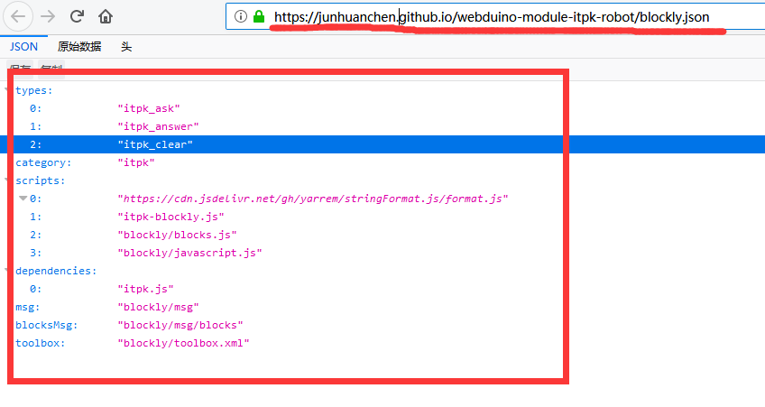
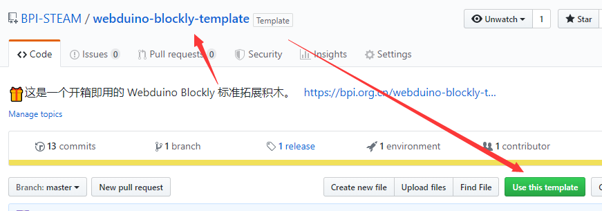
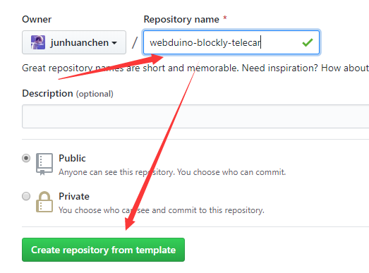
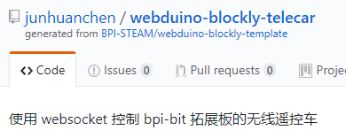
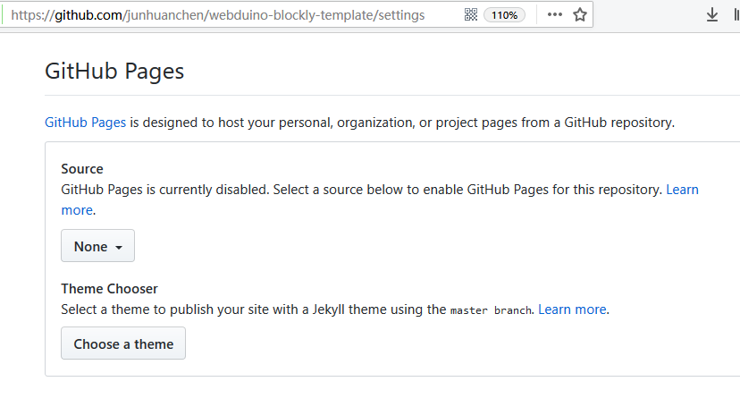
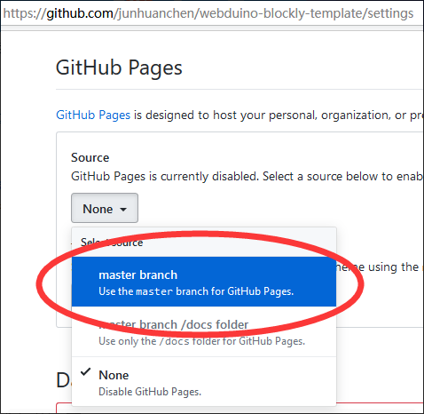
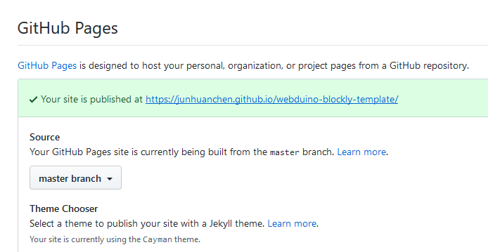

了解拓展积木模板
==================================================================

从先前的文档中得知什么是 Google Blockly 设计器，那我们就先从模仿一个通用的模板开始吧。

请先了解一下这个 `webduino-blockly-template <https://bpi.org.cn/webduino-blockly-template>`_ 示例项目，并下载获得。

拓展积木的基本构成
---------------------------------

先认识一下模板目录文件，如下一系列表格，稍后会详细介绍。

~~~~~~~~~~~~~~~~~~~~~~~~~~~~~~~~~~~~~~~~~~~~~~~~~~~~~~~~~~~~~~~~
webduino-blockly-template
~~~~~~~~~~~~~~~~~~~~~~~~~~~~~~~~~~~~~~~~~~~~~~~~~~~~~~~~~~~~~~~~

====================  ===================================================
 文件路径                             介绍与用途
====================  ===================================================
blockly                 积木资源文件夹，内容下述
demes                   积木示例、设计文件夹，内容下述
blockly.json            积木类型、依赖、实现的定义
itpk-blockly.js         积木的代码生成函数实现
itpk.html               测试原始积木功能 API 页面
itpk.js                 经典 JavaScript 接口实现
README.md               积木的使用说明文档
_config.yml             由 Github Page 创建，并提供外链。
====================  ===================================================

~~~~~~~~~~~~~~~~~~~~~~~~~~~~~~~~~~~~~~~~~~~~~~~~~~~~~~~~~~~~~~~~
webduino-blockly-template\\blockly
~~~~~~~~~~~~~~~~~~~~~~~~~~~~~~~~~~~~~~~~~~~~~~~~~~~~~~~~~~~~~~~~

====================  ===================================================
 文件路径                             介绍与用途
====================  ===================================================
msg                    积木多语言资源文件夹，内容下述
blocks.js              由 积木设计器 自动生成的样式实现
javascript.js          由 积木设计器 自动生成的积木代码生成函数实现
toolbox.xml            由你提供左侧工具列积木样式设计
====================  ===================================================

~~~~~~~~~~~~~~~~~~~~~~~~~~~~~~~~~~~~~~~~~~~~~~~~~~~~~~~~~~~~~~~~
webduino-blockly-template\\blockly\\msg
~~~~~~~~~~~~~~~~~~~~~~~~~~~~~~~~~~~~~~~~~~~~~~~~~~~~~~~~~~~~~~~~

====================  ===================================================
 文件路径                             介绍与用途
====================  ===================================================
blocks                  积木内部的相关的语言文件，内容下述
en.js                   定义工具列的 英文 文字变量
zh-hans.js              定义工具列的 简体中文 文字变量
zh-hant.js              定义工具列的 繁体中文 文字变量
====================  ===================================================

~~~~~~~~~~~~~~~~~~~~~~~~~~~~~~~~~~~~~~~~~~~~~~~~~~~~~~~~~~~~~~~~
webduino-blockly-template\\blockly\\msg\\blocks
~~~~~~~~~~~~~~~~~~~~~~~~~~~~~~~~~~~~~~~~~~~~~~~~~~~~~~~~~~~~~~~~

====================  ===================================================
 文件路径                             介绍与用途
====================  ===================================================
en.js                  定义积木内部的 英文 文字变量
zh-hans.js             定义积木内部的 简体中文 文字变量
zh-hant.js             定义积木内部的 繁体中文 文字变量
====================  ===================================================

~~~~~~~~~~~~~~~~~~~~~~~~~~~~~~~~~~~~~~~~~~~~~~~~~~~~~~~~~~~~~~~~
webduino-blockly-template\\demos
~~~~~~~~~~~~~~~~~~~~~~~~~~~~~~~~~~~~~~~~~~~~~~~~~~~~~~~~~~~~~~~~

====================  ===================================================
 文件路径                             介绍与用途
====================  ===================================================
blockly.xml             积木的使用范例，可导入 webduino blockly 
library.xml             积木的设计库，可导回设计器中重新设计
====================  ===================================================

这些基本的定义是便于修改模板积木过程中查阅其确切定义。

拓展积木的使用方法
---------------------------------

如果是托管在 Github 上的积木，可以根据 `拓展积木的使用说明 <http://doc.bpi.org.cn/zh_CN/latest/bpi-web/modules/basic.html>`_ 可知插件地址外链类似这样：`https://bpi.org.cn/webduino-blockly-template/blockly.json` 的地址，又或者是这样 `https://junhuanchen.github.io/webduino-module-itpk-robot/blockly.json` ，请确保在访问的时候，使用 https 访问且内容类似下图的 JSON 效果。

拓展积木的模板创建
---------------------------------

请尝试使用该项目进行操作，如图点击绿色按钮（Use this template），这将 fork 到你的项目中，此时。

将它配置到你的积木名称和描述，可以随意。

类似这样的效果，注意上述所述的使用方法。

上图的积木插件地址应为：`https://junhuanchen.github.io/webduino-blockly-telecar/blockly.json` ，而模板插件地址则是 `https://bpi.org.cn/webduino-blockly-template/blockly.json` ，记得在 readme 里修改对应提供的地址，将插件托管到 Github 的方法请继续往下看。

拓展积木的托管配置
---------------------------------

一般来说，我们会将积木托管在 Github 上，这样就不需要自己额外提供一个网络空间了，所以当我们 fork 项目的时候，会发现创建的模板项目，无法直接使用类似上述的插件外链使用，所以这时候需要你设置 Github Pages 的 Source，如下描述，这是因为它需要转换为该链接，以个人的 Github 为例，如下图是没有设置的情况。

选择了 Source 的 master branch 分支。

此时将会产生 Github 的外链，这就是在 Github 上提供积木的地址，积木地址务必提供 https 访问，防止被跳转回 http 。

使用这个刚生成的地址 `https://junhuanchen.github.io/webduino-blockly-template/blockly.json` ，在积木载入中确认一遍。

.. image:: images/pages_commit.png

.. Attention::

    注意 fork 的 readme 的内容并没有改变，所以发布的时候，别忘了修改积木地址。

现在，你通过 fork 就已经学会了如何创建一个动态积木，那接下来就从修改一个示例模板开始写积木吧。
