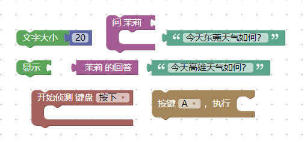
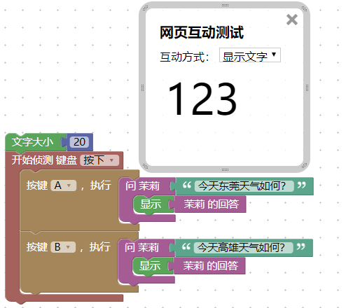

开发 Blockly 积木指导
=====================================================

下面引用一则小故事，阐述一下积木编程的起因。

这是一张关于知识与经验的示意图。

小孩子都好学，喜欢模仿，从出生就不断接受知识，然后根据自己的想法去拼凑，连成一个整体。

当接触到积木时，就想着如何去拼凑好，这个新概念在你头脑中呈现的状态如下图。

搭积木式组合模块化，能让我们将头脑中的信息组块，按照有意义的方式形成一个逻辑性、概念性的视野，帮助小孩更好地应用知识进行创作，让其呈现成这样。

当这个新知识经过理解、练习后，它就会形成一个新组块，存入我们的长期记忆，参与到下一次的组块化中。

准确来说，我们需要的是一个编程概念，一个关于事物与逻辑的组织概念，知道怎么去将各种事物拼接组装成我们想要的事物，积木编程应该引导人们去学会这个概念。

.. toctree::
   :maxdepth: 2

   mechanism.rst
   blockly.rst

