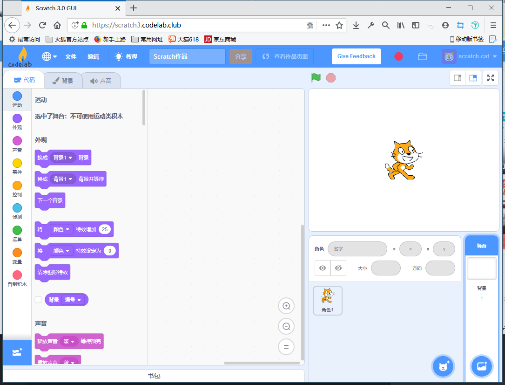
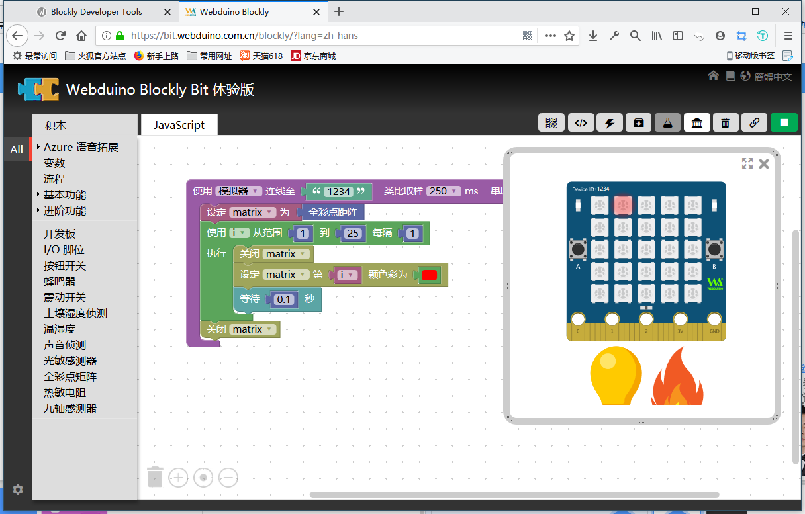

介绍积木运行机制
=====================================================

本文会在此先讲点积木编程的哲学，如果你不喜欢，可以跳过该章节，然后再从实际出发，如我们现在所看到的积木有两种体系，一种是 Scratch 体系，另一种则是 Blockly 体系，下面单独介绍这两种积木设计。

Scratch 积木体系
--------------------

Scratch 是麻省理工学院的“终身幼儿园团队”（Lifelong Kindergarten Group）开发的图形化编程工具，主要面对青少年开放。

现在大多都在谈 2019 年后正式发布的 Scratch3 版本了，如果你对开发它有兴趣可以看看这个的项目 `添加 Scratch3 自定义积木 <https://github.com/junhuanchen/scratch3-eim-mpfshell>`_ ，本文暂不对此深入阐述。

在线试试 `Codelab Scratch3 <https://scratch3.codelab.club/>`_ 编程吧，这由我们的开源合作伙伴提供。

Blockly 积木体系
--------------------

2012 年 6 月，Google 发布了完全可视化的编程语言 Google Blockly，类似 MIT 的儿童编程语言 Scratch ， 你可以通过类似玩乐高玩具的方式用一块块图形对象构建出应用程序。每个图形对象都是代码块，你可以将它们拼接起来，创造出简单功能，然后将一个个简单功能 组合起来，构建出一个程序。整个过程只需要鼠标的拖曳，不需要键盘敲击。

说说 Scratch 与 Blockly 的机制区别
----------------------------------------

主要也就这两大类型积木做得比较好了，其他都是一些不起眼的小玩意。

虽然我最终是介绍 Blockly 是如何开发的，但我们也应当学习 Scratch 的设计理念和运行机制，这将有利于我们更好的开发积木。

首先 Scratch 已经拥有了一个自己专属的运行环境（虚拟机），在这个环境上，运行自己所定义的积木，早在 2.0 时期使用的是 Adobe 的 Flash AIR 环境，现在你还可以看到它的影子，但随着 3.0 的推出，已经全面改用 JavaScript(React) 了，也就是拥有了良好的浏览器跨平台性。

这点和 Webduino Blockly 是基本一致的，都是基于 JavaScript 的环境，但也存在很大的区别，比如说 Scratch3 并不鼓励直接使用代码编程，本质上还是积木调用接口编程。（但 Scratch3 也有 Blockly 接口）

对 Scratch3 来说，所谓的积木只是某一类功能的调用接口，可以理解为某一类插槽，在定义的时候，就是为了将积木绑定到某一个函数、模块上，直接将其功能调起，所以 Scratch3 的积木设计大多都是单例设计，意味着，一个积木对应一个功能。

而 Blockly 并非如此设计，举例来说 Webduino Blockly 是一种将 Blockly 积木运行在 JavaScript 的环境上的网站，它将执行由 Blockly 的积木将生成对应的 JavaScript 代码。

这意味着，Blockly积木块本身只是代码的映射，并非是某一个可以调用的功能，这个区别你应该可以体验出来。

可以在此体验 `Blockly <https://developers.google.cn/blockly/>`_ 的积木运行。

不同的运行机制会导致什么现象呢？
----------------------------------------

首先 Scratch3 可以直接点击积木运行查看效果，而 Blockly 需要点击运行才能查看效果，因为需要所有积木生成代码后才能运行查看整体效果，但技术是会发展变革的，并非 Blockly 做不到，只是目前没必要这样做。

积木的设计理念
^^^^^^^^^^^^^^^^^^^^^^

直接运行积木的设计为开发者带来的理念就是，开发者设计的每一个积木都是期望可以直接运行的，也就跳过了定义和配置的环节，每一次都是全新的开始，这对于程序来说，积木就是单例，不可抽象，所点即所得。

从程序设计的角度上讲，这并不能成就一个大型程序，只能作为一般的小程序来体验，但 Scratch3 本就是一个面向少儿编程的工具，不需要对它有过多的要求。

而 Blockly 的设计理念并非如此，设计思路复杂且巧妙，主要强调的是 积木 就是 代码，只不过是在研究代码的组织形式，所谓的拼接积木，实际上就是在组织不同的代码块，如果我们把每一段功能代码当作是一份积木，那么产生的结果就是 Blockly 将会拆分积木中的代码，因为它可以尽可能的抽象积木块供大家自由组合。

积木的教育结果
^^^^^^^^^^^^^^^^^^^^^^

经过 Scratch3 和 Blockly ，从编程教育这个角度来看， Scratch3 的设计显得有些狭隘了，因为它并不鼓励你学会代码编程，反观 Blockly ，它本来就是代码的另一种表现形式，如果你学会了组织 Blockly 积木，实际上也就学会了如何组织代码，转移到写代码这件事，实际上就很自然而然的了。

编程确实不是积木，但积木编程可以映射出一种现象，这种现象也许是你在任何语言编程（甚至是生活）中都会遇到的问题，那就是如何组织许多小部件形成一件完整的作品。

我希望，编程也好，积木也罢，都是指引我们学习事物本质的工具，而非停留在表面现象，只会使用，而不知其原理。

接下来就正式讲讲，如何设计与开发 Webduino Blockly 积木块吧。
