# 修改拓展积木模板

> 欲读懂内部工作机制，请学习 [HTML5](https://www.runoob.com/html/html5-intro.html) 和 [ECMAScript 6](https://www.runoob.com/w3cnote/es6-concise-tutorial.html) 。

## 查看范例积木

进入积木设计器，一般使用国内源 [Blockly Developer Tools](http://walkline.wang/blockly/blockfactory/) 如下图。

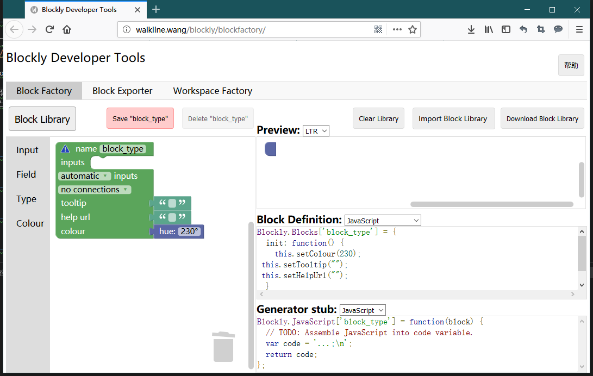

将 [webduino-blockly-template](https://github.com/BPI-STEAM/webduino-blockly-template) 代码 clone 得到（或使用模板新建项目），将文件里的 demo/library.xml 导回积木设计器，参考已有积木，重新设计出属于你的积木。

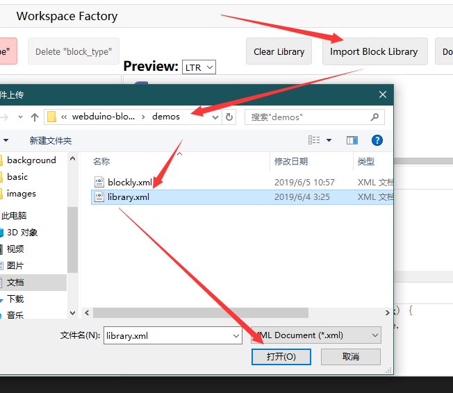

可以看到有如下积木类型。

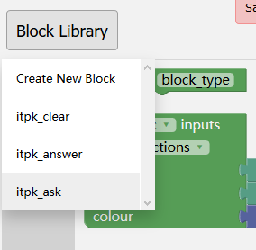

让我们点开一个 itpk_answer 看看都是如何定义的。

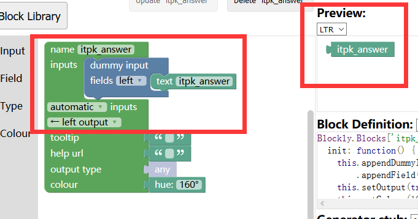

可以看到，左侧是积木编辑工具，右侧则是生成的结果：

- 积木外观样式预览（Preview）
- 积木外观定义代码（Block Definition）
- 代码生成函数桩（Generator stub）

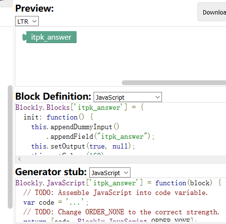

现在知道有这些东西就行，回头就会用上，至少知道这些代码都是使用该工具生成的。

## 设计新的积木

如果我们想做一个新的功能积木，可以建立在已有的基础上，比如参考一个已经存在的积木，将其修改成我们想要的样子，再封装成其他功能，拿查询本机 IP 的积木来句个例子，如果要在 itpk_ask 的基础上修改的话，那么积木应该长怎样呢？

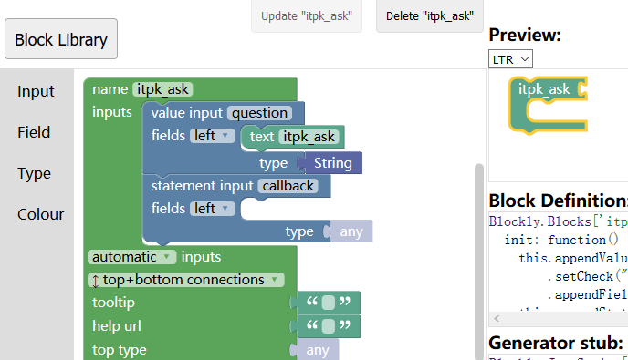

我们可以参考 itpk_ask 的积木设计，修改它直接变成我们想要的祥子，拖动一个无参数的积木连接块，如下图。

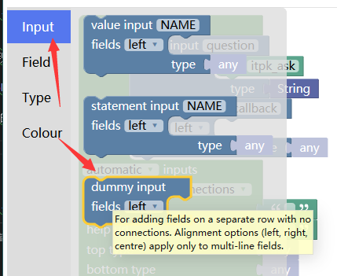

拖拽出来，放到和其他 Input 一样的地图，并且复制一下字符串对应过来，如下图。

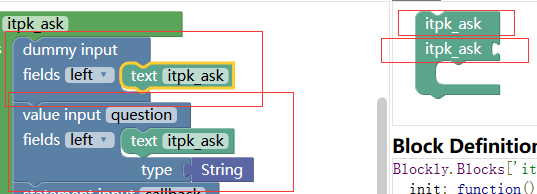

经过对比后可以发现 dummy input 不能再结合，所以看到的末尾是无法衔接其他模块的，此时我们将它设计成查 IP 的积木，如下图修改。（移除 value input 并编辑 text itpk_ask 积木块）

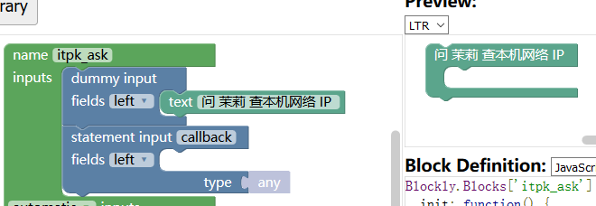

现在积木就设计完成了，但我们需要看，它对应的样式代码是怎样的才能放入我们的 Webduino Blockly 当中，所以看 Block Definition 的代码。

```javascript
Blockly.Blocks['itpk_ask'] = {
  init: function() {
    this.appendDummyInput()
        .appendField("问 茉莉 查本机网络 IP ");
    this.appendStatementInput("callback")
        .setCheck(null);
    this.setPreviousStatement(true, null);
    this.setNextStatement(true, null);
    this.setColour(160);
 this.setTooltip("");
 this.setHelpUrl("");
  }
};
```

以上就是你所见到的积木它的定义代码，可以理解为是这段代码描述了积木的样子，也就是说，你也可以不通过 Blockly 设计器来修改积木外观，以及它对应的需要用户实现的桩代码：

```javascript
Blockly.JavaScript['itpk_ask'] = function(block) {
  var statements_callback = Blockly.JavaScript.statementToCode(block, 'callback');
  // TODO: Assemble JavaScript into code variable.
  var code = '...;\n';
  return code;
};
```

这个函数可以为积木提供背后生成的代码环境，例如将 var code = 'var test = 123;\n'; 这样就表示，这个积木块拖拽出来将提供 `var test = 123;\n` 的代码，也就是所谓的生成代码积木，积木块对应着代码，接下来我们就要将其导入我们的原本的积木当中。

我们最后来改个名字并保存一下新的积木块，免得丢失了，如图。

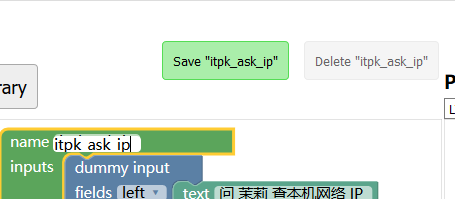

积木设计器还有很多重要的功能需要你自己去发掘，比如：

- Block Exporter 可以批量选取积木并导出对应代码。

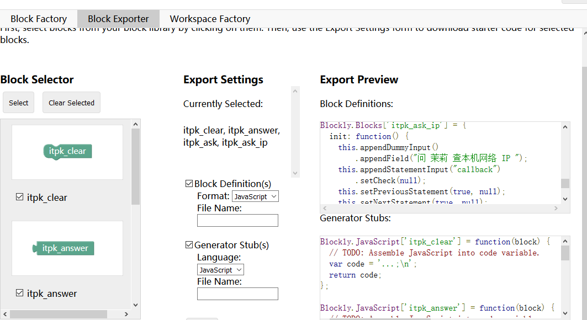

- Workspace Factory 可以模拟设计的积木大致的使用方法，与其他积木进行对接的尝试，还可以导出（Export）积木工具列 toolbox.xml 文件供你参考。

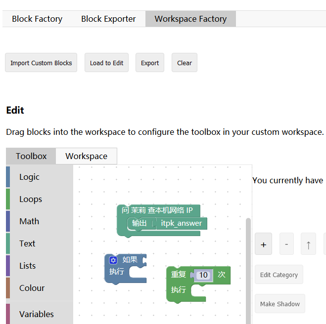

以上功能，如果有涉及到的都会提及，但不会面面俱到，如果有疑问可以到社区里提问，有关于积木设计器的功能预览就普及到这里了，记得下载保存你的积木配置（Download）。

## 添加新的积木

## 添加对应功能

## 添加积木语言

## 代码生成测试

## 积木功能测试

## 积木发布测试
