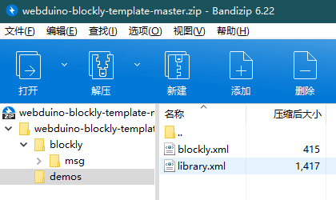
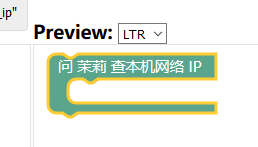
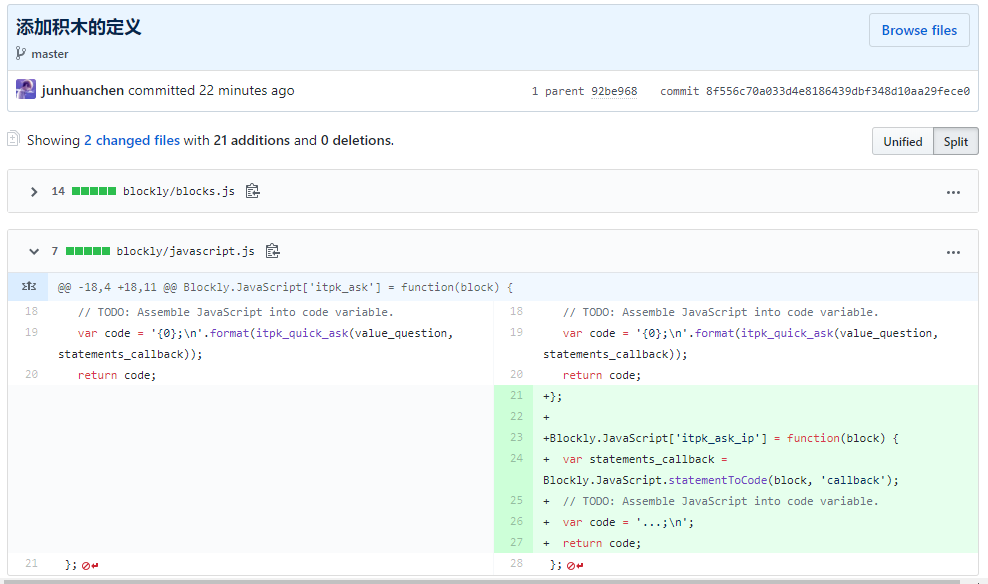
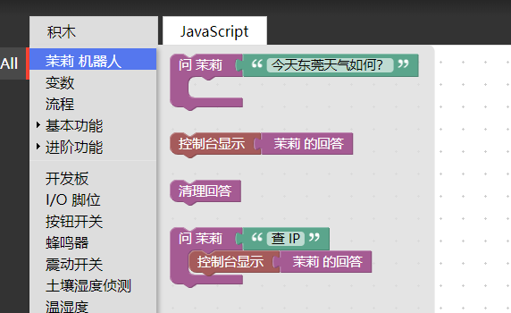
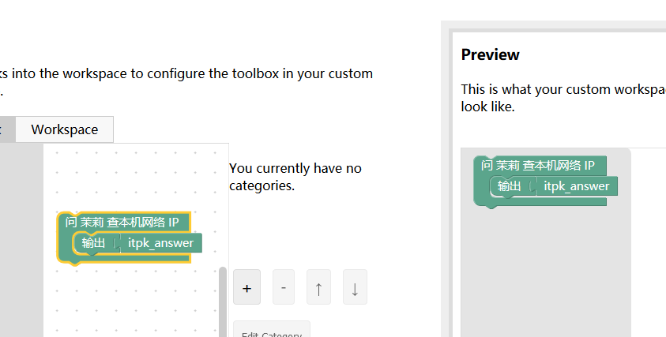
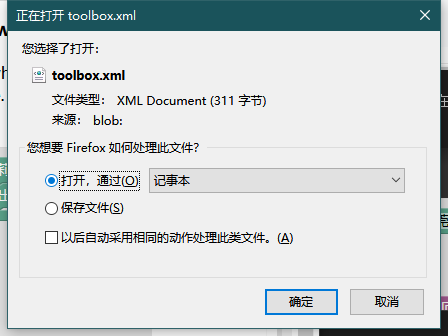
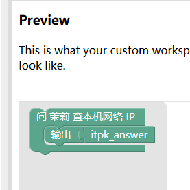
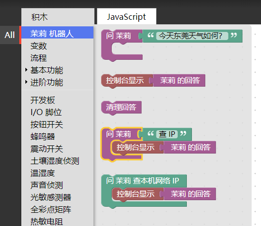

# 修改拓展积木模板

> 欲读懂内部工作机制，请学习 [HTML5](https://www.runoob.com/html/html5-intro.html) 和 [ECMAScript 6](https://www.runoob.com/w3cnote/es6-concise-tutorial.html) 。

我们在前一节中已经掌握了如何创建和使用积木的方法，这节我们将基于标准模板的积木进行开发。

## 查看范例积木

进入积木设计器，可以使用国内源 [Blockly Developer Tools](http://walkline.wang/blockly/blockfactory/) 如下图。


使用该模板项目 [webduino-blockly-template](https://github.com/BPI-STEAM/webduino-blockly-template) ，并将它的代码通过 download 或 clone 得到它。



将文件里的 demo/library.xml 导回积木设计器，参考已有积木，重新设计出属于你的积木。


可以看到有如下积木类型。


让我们点开一个 itpk_answer 看看都是如何定义的。


可以看到，左侧是积木编辑工具，右侧则是生成的结果：

- 积木外观样式预览（Preview）
- 积木外观定义代码（Block Definition）
- 代码生成函数桩（Generator stub）


现在知道有这些东西就行，回头就会用上，至少知道这些代码都是使用该工具生成的。

## 设计新的积木

如果我们想做一个新的功能积木，可以建立在已有的基础上，比如参考一个已经存在的积木，将其修改成我们想要的样子，再封装成其他功能，拿查询本机 IP 的积木来句个例子，如果要在 itpk_ask 的基础上修改的话，那么积木应该长怎样呢？


我们可以参考 itpk_ask 的积木设计，修改它直接变成我们想要的祥子，拖动一个无参数的积木连接块，如下图。


拖拽出来，放到和其他 Input 一样的地图，并且复制一下字符串对应过来，如下图。


经过对比后可以发现 dummy input 不能再结合，所以看到的末尾是无法衔接其他模块的，此时我们将它设计成查 IP 的积木，如下图修改。（移除 value input 并编辑 text itpk_ask 积木块）


我们最后来改个名字并保存一下新的积木块，免得弄丢了，如下图。


现在积木就设计完成了，但我们需要看，它对应的样式代码是怎样的才能放入我们的 Webduino Blockly 当中，所以看 Block Definition 的代码。

```javascript
Blockly.Blocks['itpk_ask_ip'] = {
  init: function() {
    this.appendDummyInput()
        .appendField("问 茉莉 查本机网络 IP ");
    this.appendStatementInput("callback")
        .setCheck(null);
    this.setPreviousStatement(true, null);
    this.setNextStatement(true, null);
    this.setColour(160);
 this.setTooltip("");
 this.setHelpUrl("");
  }
};
```

以上就是你所见到的积木它的定义代码，可以理解为是这段代码描述了积木的样子，也就是说，你也可以不通过 Blockly 设计器来修改积木外观，以及它对应的需要用户实现的桩代码：

```javascript
Blockly.JavaScript['itpk_ask_ip'] = function(block) {
  var statements_callback = Blockly.JavaScript.statementToCode(block, 'callback');
  // TODO: Assemble JavaScript into code variable.
  var code = '...;\n';
  return code;
};
```

这个函数可以为积木提供背后生成的代码环境，例如将 `var code = 'var test = 123;\n';` 这样就表示，这个积木块拖拽出来将提供 `var test = 123;\n` 的代码，也就是所谓的积木生成代码，积木块对应着代码，接下来我们就要将其导入我们的原本的积木当中。

## 添加新的积木

先前我们制作了一个积木块，我们需要将它添加到我们自己的积木里，先看一下我们想要添加的积木的效果。



进入 Block Exporter 可以批量选取积木并导出对应代码。


获取这两段定义内容，然后将它添加到创建的模板积木中，注意结合前一章的目录下的文件描述。

blockly_exporter_get.png

进入 blockly/blocks.js ，在后面添加 Block Definitions 的代码。

```javascript
Blockly.Blocks['itpk_ask_ip'] = {
  init: function() {
    this.appendDummyInput()
        .appendField("问 茉莉 查本机网络 IP ");
    this.appendStatementInput("callback")
        .setCheck(null);
    this.setPreviousStatement(true, null);
    this.setNextStatement(true, null);
    this.setColour(160);
 this.setTooltip("");
 this.setHelpUrl("");
  }
};
```

进入 blockly/javascript.js 也同样添加 Generator Stubs 的代码。

```javascript
Blockly.JavaScript['itpk_ask_ip'] = function(block) {
  var statements_callback = Blockly.JavaScript.statementToCode(block, 'callback');
  // TODO: Assemble JavaScript into code variable.
  var code = '...;\n';
  return code;
};
```

如果不清楚如何操作的可以看这个提交 [添加积木的定义](https://github.com/junhuanchen/webduino-blockly-template/commit/8f556c70a033d4e8186439dbf348d10aa29fece0) 。



当你添加完了积木的定义，不代表积木可以使用，还需要在 blockly/toolbox.xml 中添加你积木的工具栏位置，否则将无法显示到左侧来，例如下图的效果。



那么我们应该如何做呢？先是进入 Workspace Factory 可以模拟设计的积木大致的使用方法，与其他积木进行对接的尝试，还可以导出（Export）积木工具列 toolbox.xml 文件供你参考。


然后拿我们设计的积木出来。



此时通过下图的方式得到 toolbox.xml 文件，然后添加到我们原本的 blockly/toolbox.xml 文件当中。


下载打开它得到 xml 文件代码。



```xml
<xml xmlns="http://www.w3.org/1999/xhtml" id="toolbox" style="display: none;">
  <block type="itpk_ask_ip">
    <statement name="callback">
      <block type="text_print">
        <value name="TEXT">
          <block type="itpk_answer"></block>
        </value>
      </block>
    </statement>
  </block>
</xml>
```

实际上就可以看出积木的对应效果，例如 `<block>` 标签对应的就是积木块， `<statement>` 标签对应的就是结合的积木块，所以我们可以在工具栏看到如下效果。



现在将其添加到我们的原本的模板积木当中，与其他存在的积木块作出对比。

以下是原内容：

```xml
<category id="catItpk">
  <block type="itpk_ask">
    <value name="question">
      <block type="text">
        <field name="TEXT">今天东莞天气如何？</field>
      </block>
    </value>
  </block>
  <block type="console">
    <value name="console">
      <block type="itpk_answer"></block>
    </value>
  </block>
  <block type="itpk_clear">
  </block>
  <block type="itpk_ask">
  <value name="question">
    <block type="text">
      <field name="TEXT">查 IP </field>
    </block>
  </value>
	<statement name="callback">
	<block type="console">
	<value name="console">
		<block type="itpk_answer"></block>
	</value>
	</block>
	</statement>
  </block>
</category>
```

以下是原内容，现在在后面添加新内容，变成如下代码。

```xml
<category id="catItpk">
  <block type="itpk_ask">
    <value name="question">
      <block type="text">
        <field name="TEXT">今天东莞天气如何？</field>
      </block>
    </value>
  </block>
  <block type="console">
    <value name="console">
      <block type="itpk_answer"></block>
    </value>
  </block>
  <block type="itpk_clear">
  </block>
  <block type="itpk_ask">
  <value name="question">
    <block type="text">
      <field name="TEXT">查 IP </field>
    </block>
  </value>
	<statement name="callback">
	<block type="console">
	<value name="console">
		<block type="itpk_answer"></block>
	</value>
	</block>
	</statement>
  </block>
  <block type="itpk_ask_ip">
    <statement name="callback">
      <block type="console">
        <value name="console">
          <block type="itpk_answer"></block>
        </value>
      </block>
    </statement>
  </block>
</category>
```

现在，你已经将自己设计的积木添加进去了，此时你还需要最后一步，就可以载入积木看到效果了。

在 blockly.json 中添加你的积木类型（types），因为它是一个全新的积木所以需要添加进去，否则不会被载入到动态积木中。

看一下 blockly.json 的内容，然后在 types 列中添加 `"itpk_ask_ip",`

```json
{
  "types": [
    "itpk_ask_ip",
    "itpk_ask",
    "itpk_answer",
    "itpk_clear"
  ],
  "category": "itpk",
  "scripts": [
    "https://cdn.jsdelivr.net/gh/yarrem/stringFormat.js/format.js",
    "itpk-blockly.js",
    "blockly/blocks.js",
    "blockly/javascript.js"
  ],
  "dependencies": [
    "itpk.js"
  ],
  "msg": "blockly/msg",
  "blocksMsg": "blockly/msg/blocks",
  "toolbox": "blockly/toolbox.xml"
}
```

> 以下的操作均在浏览器无痕模式下进行。（等你足够了解后，可以先移除积木后刷新再重新载入积木）。

现在你可以提交它，然后等一会提交成功后，可以载入 `https://junhuanchen.github.io/webduino-blockly-template/blockly.json` 积木查看效果了。（写这篇文档的时候，不小心操作失误了）



## 添加对应功能

## 添加积木语言

## 代码生成测试

## 积木功能测试

## 积木发布测试
