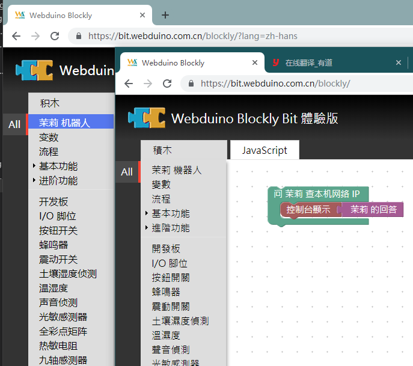
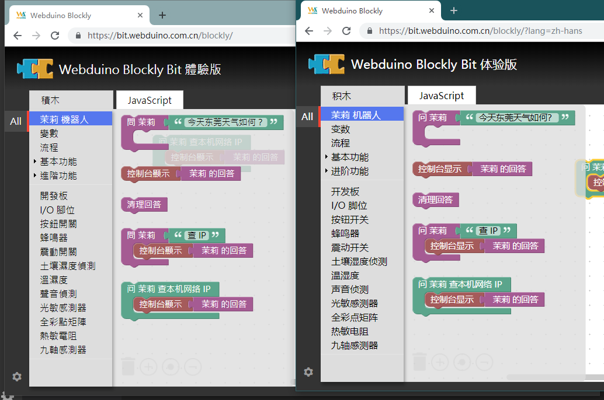

## 添加积木语言

最后积木制作出来后，为了与国际化接轨，我们还需要为积木添加多语言，但这一步需要修改 blocks.js 设计器生成代码，连接多语言变量的定义，所以请确保该积木已经相对稳定后再添加多语言功能。

我们拿内部简体中文的定义来举例子，例如 blockly/msg/zh-hans.js 文件中的内容。

```javascript
MSG.catItpk = '茉莉 机器人';
```

这实际上就对应着 toolbox.xml 的首行 `<category id="catItpk">` 也就是工具栏的多语言，如下图。



接着改积木的多语言需要绑定到设计器代码中，例如 blockly/msg/blocks/zh-hans.js 中提供的变量。

```javascript
Blockly.Msg.itpk_clear = "清理回答";
Blockly.Msg.itpk_answer = " 茉莉 的回答";
Blockly.Msg.itpk_ask = "问 茉莉 ";
```

但这些变量还需要添加到 blockly/blocks.js 替换字符串常量，如下代码。

```javascript
Blockly.Blocks['itpk_clear'] = {
  init: function() {
    this.appendDummyInput()
        .appendField(Blockly.Msg.itpk_clear);
    this.setPreviousStatement(true, null);
    this.setNextStatement(true, null);
    this.setColour(315);
 this.setTooltip("");
 this.setHelpUrl("");
  }
};

Blockly.Blocks['itpk_answer'] = {
  init: function() {
    this.appendDummyInput()
        .appendField(Blockly.Msg.itpk_answer);
    this.setOutput(true, null);
    this.setColour(315);
 this.setTooltip("");
 this.setHelpUrl("");
  }
};

Blockly.Blocks['itpk_ask'] = {
  init: function() {
    this.appendValueInput("question")
        .setCheck("String")
        .appendField(Blockly.Msg.itpk_ask);
    this.appendStatementInput("callback")
        .setCheck(null);
    this.setPreviousStatement(true, null);
    this.setNextStatement(true, null);
    this.setColour(315);
 this.setTooltip("");
 this.setHelpUrl("");
  }
};

Blockly.Blocks['itpk_ask_ip'] = {
  init: function() {
    this.appendDummyInput()
        .appendField("问 茉莉 查本机网络 IP ");
    this.appendStatementInput("callback")
        .setCheck(null);
    this.setPreviousStatement(true, null);
    this.setNextStatement(true, null);
    this.setColour(160);
 this.setTooltip("");
 this.setHelpUrl("");
  }
};
```


可以将 itpk_ask 和 itpk_ask_ip 的定义代码做对比，实际上就是将 `.appendField("字符串");` ，替换成字符串变量 `.appendField(Blockly.Msg.字符串);` ，修改后出来的效果如下图。（可以看到 itpk_ask_ip 并没有被汉化，还处于简体中文的字符串常量）


