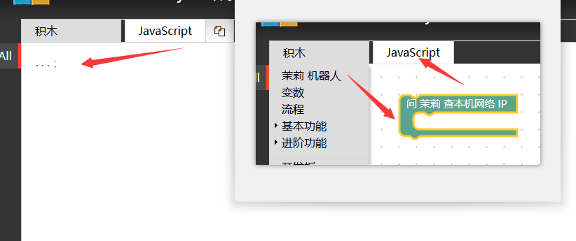
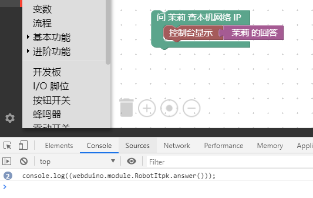

## 代码生成测试

我们已经能够将自己设计的积木导入积木工具了，但还没有配合积木生成的代码，比如像下面这样，左边是积木，右边是代码。


我们需要知道积木生成代码的在 blockly/javascript.js 中有这样的 Generator Stubs 的代码。

```javascript
Blockly.JavaScript['itpk_ask_ip'] = function(block) {
  var statements_callback = Blockly.JavaScript.statementToCode(block, 'callback');
  // TODO: Assemble JavaScript into code variable.
  var code = '...;\n';
  return code;
};
```

在 Webduino Blockly 中点击 JavaScript 就会这样显示出来，如下图所示。



可以看到，它实际上就对应 `var code = '...;\n';` 的返回值，所以我们只需要修改这部分内容。

比如说，将其修改成 `var code = 'console.log("hello");\n';` 这就意味着，当你拖出这个代码将会得到 `console.log("hello");\n` 代码，让我们来试试修改 blockly/javascript.js 。

```javascript
Blockly.JavaScript['itpk_ask_ip'] = function(block) {
  var statements_callback = Blockly.JavaScript.statementToCode(block, 'callback');
  // TODO: Assemble JavaScript into code variable.
  var code = 'console.log("hello");\n';
  return code;
};
```

此时效果图如下，提交后重新载入积木即可看到效果。


此时你会注意到，明明我们的积木中有 控制台显示 茉莉 的回答 ，但是代码中并没有，那该如何显示出来？看下面代码的 `console.log(statements_callback);` 的内容，然后继续添加。

```javascript
Blockly.JavaScript['itpk_ask_ip'] = function(block) {
  var statements_callback = Blockly.JavaScript.statementToCode(block, 'callback');
  // TODO: Assemble JavaScript into code variable.
  
  console.log(statements_callback);

  var code = 'console.log("hello");\n';
  return code;
};
```

这时候就意味着 F12 的开发者调试工具的控制台，可以看到如下效果，也就是你所包含的代码内容，掌握了这个方法后，就可以调试积木代码生成的情况了。



当你查看代码的时候，它将会生成 控制台显示 茉莉 的回答 的效果，但这个做法只是了解一下现象，并不推荐在这里修改，因为设计器会重新生成代码，所以要减少该部分代码，全部采用外部函数调用的方法，那么我们如果想要轻松的添加自己的积木代码，请参考 itpk-blockly.js 是怎么写的。

举个例子，看 `itpk_answer` 的积木定义，它调用了 `itpk_answer();` 函数。

```javascript
Blockly.JavaScript['itpk_answer'] = function(block) {
  // TODO: Assemble JavaScript into code variable.
  var code = itpk_answer();
  // TODO: Change ORDER_NONE to the correct strength.
  return [code, Blockly.JavaScript.ORDER_NONE];
};
```

而这个函数就被实现在  itpk-blockly.js 中，也就是如下代码。

```javascript
scope.itpk_answer = function () {
  return "webduino.module.RobotItpk.answer()";
}
```

所以在得到设计器的代码后，只需要将  `var code = '...;\n';` 修改成 `var code = itpk_answer();` ，极大的减少了设计器的代码变动。

我们继续看另一个例子。

```javascript
Blockly.JavaScript['itpk_ask'] = function(block) {
  var value_question = Blockly.JavaScript.valueToCode(block, 'question', Blockly.JavaScript.ORDER_ATOMIC);
  var statements_callback = Blockly.JavaScript.statementToCode(block, 'callback');
  // TODO: Assemble JavaScript into code variable.
  var code = '{0};\n'.format(itpk_quick_ask(value_question, statements_callback));
  return code;
};
```

它就是 `itpk_ask` 积木的例子，只需要注意到这行代码。

```javascript
var code = '{0};\n'.format(itpk_quick_ask(value_question, statements_callback));
```

其他都是设计器自动生成的，解释一下 `itpk_quick_ask` 的实现过程。

```javascript
scope.itpk_quick_ask = function (question, callback) {
  return "webduino.module.RobotItpk.quick_ask({0}, function(){\n  {1}})".format(question, callback);
}
```

在 blockly/itpk-blockly.js 我们看到类似 `"{0}-{1}".format(1, 2)` 的操作，这个操作是将代码进行格式化，可以帮助生成代码的格式化输入，提供字符串的封装方法，而不是 "1" + "-" + "2" 的方式，例如下述代码。

```javascript
scope.itpk_quick_ask = function (question, callback) {
  return "webduino.module.RobotItpk.quick_ask(" + question + ", function(){\n  " + callback + "})";
}
```

不建议写出以上字符串拼装代码，因为积木设计大量充斥这种字符串相互包含的关系，Code 会显得非常 Ugly ，所以使用这样的方式去开发你的积木对应的代码吧。
