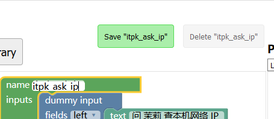

## 设计新的积木

如果我们想做一个新的功能积木，可以建立在已有的基础上，比如参考一个已经存在的积木，将其修改成我们想要的样子，再封装成其他功能，拿查询本机 IP 的积木来举例，如果要在 itpk_ask 的基础上修改的话，那么积木应该长怎样呢？


我们可以参考 itpk_ask 的积木设计，修改它直接变成我们想要的祥子，拖动一个无参数的积木连接块，如下图。


拖拽出来，放到和其他 Input 一样的地图，并且复制一下字符串对应过来，如下图。


经过对比后可以发现 dummy input 不能再结合，所以看到的末尾是无法衔接其他模块的，此时我们将它设计成查 IP 的积木，如下图修改。（移除 value input 并编辑 text itpk_ask 积木块）


我们最后来改个名字并保存一下新的积木块，免得弄丢了，如下图。



现在积木就设计完成了，但我们需要看，它对应的样式代码是怎样的才能放入我们的 Webduino Blockly 当中，所以看 Block Definition 的代码。

```javascript
Blockly.Blocks['itpk_ask_ip'] = {
  init: function() {
    this.appendDummyInput()
        .appendField("问 茉莉 查本机网络 IP ");
    this.appendStatementInput("callback")
        .setCheck(null);
    this.setPreviousStatement(true, null);
    this.setNextStatement(true, null);
    this.setColour(160);
 this.setTooltip("");
 this.setHelpUrl("");
  }
};
```

以上就是你所见到的积木它的定义代码，可以理解为是这段代码描述了积木的样子，也就是说，你也可以不通过 Blockly 设计器来修改积木外观，以及它对应的需要用户实现的桩代码：

```javascript
Blockly.JavaScript['itpk_ask_ip'] = function(block) {
  var statements_callback = Blockly.JavaScript.statementToCode(block, 'callback');
  // TODO: Assemble JavaScript into code variable.
  var code = '...;\n';
  return code;
};
```

这个函数可以为积木提供背后生成的代码环境，例如将 `var code = 'var test = 123;\n';` 这样就表示，这个积木块拖拽出来将提供 `var test = 123;\n` 的代码，也就是所谓的积木生成代码，积木块对应着代码，接下来我们就要将其导入我们的原本的积木当中。
