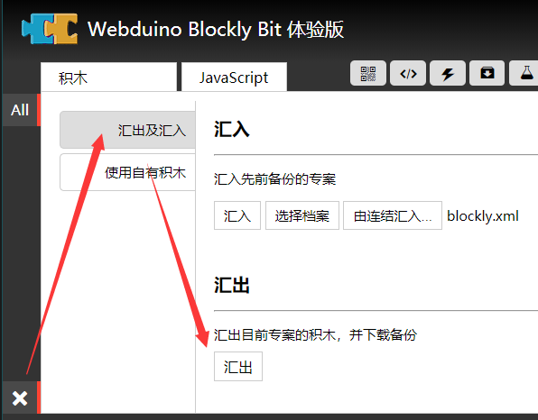
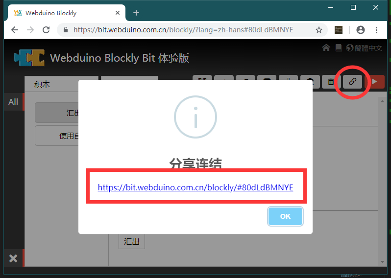

## 积木使用示例

> 分享示例前，请务必先载入积木后再导入示例。

最后要如何将你的积木插件分享给其他人，除了给积木插件地址，还需要处理一下自己的 readme 帮助文件，以及在里面提供一些使用案例，如下图可以导出你的示例代码。

示例文件一般推荐保存积木目录下的 demos/blockly.xml ，除了这样做还可以在线分享链接，如下图指示。

但是，但凡内部案例涉及到的外部积木插件，都必须要提前导入，否则将显示一个积木黑块表示不可用。
