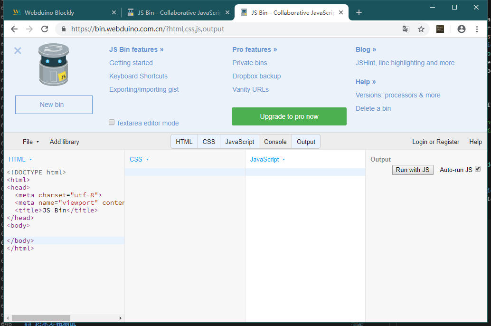

## 积木功能测试

当我们知道了如何添加自己的功能代码，就要脱离这个 Blockly 生产环境来测试我们的代码了，在开发环境中，分本地和在线测试运行代码，需要注意的是，本地测试的代码具备一定的特殊性，比如没办法依赖 Webduino 中提供的其他功能，例如无法使用 webduino.module 这个模块变量。

### 本地测试积木功能

所以在本地写经典代码时，一般需要单独测试和移植，例如下面的茉莉机器人 API 的测试代码 `itpk.html` 。

```javascript
<!DOCTYPE html>
<html>

<head>
    <meta charset="utf-8">
    <title>茉莉机器人 API 测试</title>
    <script src="https://code.jquery.com/jquery-3.3.1.min.js"></script>
</head>

<body>
    <script>
        AskItpk = function (question) {
            $.post("http://i.itpk.cn/api.php", {
                'question': question
            }, function (data) {
                console.log("数据：" + data);
            });
        }
        AskItpk('东莞天气如何？');
    </script>
</body>

</html>
```

> 代码无高低，能用就行。

通过这样的方式再转换改写成 `itpk.js` 的模块结构代码，看如下代码。

```javascript
+(function (factory) {
    if (typeof exports === 'undefined') {
        factory(webduino || {});
    } else {
        module.exports = factory;
    }
}(function (scope) {
    'use strict';
  
    const url = "https://i.itpk.cn/api.php";
    var answer = "";

    function RobotItpk() {
        Module.call(this);
    }

    RobotItpk.ask = function (question) {
        $.post(url, {
            'question': question
        }, function (respond) {
            // console.log(data);
            answer = respond;
        });
    }
    
    RobotItpk.clear = function () {
        answer = "";
    }
    
    RobotItpk.answer = function () {
        return answer.replace("[cqname]", "moli");
    }

    RobotItpk.quick_ask = function (question, callback) {
        $.post(url, {
            'question': question
        }, function (respond) {
            answer = respond
            callback();
        });
    }

    scope.module.RobotItpk = RobotItpk;

}));

function unit_test() {
  webduino.module.RobotItpk.ask('东莞天气如何？');
  setTimeout(function(){
    console.log(webduino.module.RobotItpk.answer());
    webduino.module.RobotItpk.ask('高雄天气如何？');
    setTimeout("console.log(webduino.module.RobotItpk.answer())", 1000);
  }, 1000);
  
}

// unit_test();

```

但你也可以直接使用 AMD JS 代码的方式，规范的模块化整合到积木环境中，这就需要你具备一定的现代  JS 代码模块规范的基础，可以先了解 [webpack-demo](https://github.com/BPI-STEAM/webpack-demo) 或配合这个示例项目 [webpack-develop-example](https://github.com/BPI-STEAM/webpack-develop-example) 来操作，这将有利于你写出规范的专业代码，就像下面这样的代码直接编译运行在浏览器，这将高度符合 Webduino Blockly 的运行环境。

```javascript
(function (root, factory) {
    if (typeof define === 'function' && define.amd) {
        // AMD
        define(['jquery'], factory);
    } else if (typeof exports === 'object') {
        // Node, CommonJS etc
        module.exports = factory(require('jquery'));
    } else {
        // Browser global variable (root is window)
        root.returnExports = factory(root.jQuery);
    }
}(this, function ($) {

    'use strict';

    const url = "https://i.itpk.cn/api.php";
    var answer = "";

    var proto;

    var RobotItpk = function () {

    };

    RobotItpk.prototype = proto = Object.create({
        constructor: {
            value: RobotItpk
        }
    });

    proto.ask = function (question) {
        $.post(url, {
            'question': question
        }, function (respond) {
            console.log(respond);
            answer = respond;
        });
    }

    proto.clear = function () {
        answer = "";
    }

    proto.answer = function () {
        return answer.replace("[cqname]", "moli");
    }

    proto.quick_ask = function (question, callback) {
        $.post(url, {
            'question': question
        }, function (respond) {
            console.log(respond);
            answer = respond
            callback();
        });
    }

    window.RobotItpk = RobotItpk;

}));

var ts = new window.RobotItpk();
ts.ask("nihao");

setTimeout(function () {
    document.write('<h1>' + ts.answer() + '</h1>');
}, 1000);
```

### 在线测试积木功能

我们可以在积木的时候里面进行代码的查看，如下图操作。


如你所见，可以在这里进行代码的运行以及调试。



[JS bin](https://bin.webduino.com.cn/?html,css,js,output) 是一款在线编写浏览器 JS 工具，可以在这里进行你的调试于测试，比如我们可以这样做，将 itpk-blockly.js 或 itpk.js 文件代码放入下图所述位置，即可自动运行输出。


> 上图需要你点开 Console 控制台输出 debug 信息，并且粘贴 itpk.js 代码后拉到低下取消 unit_test() 的注释，从而运行单元测试，默认修改代码自动运行。
