# 修改拓展积木模板

> 欲读懂内部工作机制，请学习 [HTML5](https://www.runoob.com/html/html5-intro.html) 和 [ECMAScript 6](https://www.runoob.com/w3cnote/es6-concise-tutorial.html) 。

我们在前一节中已经掌握了如何创建和使用积木的方法，这节我们将基于标准模板的积木进行开发。

## 查看范例积木

进入积木设计器，可以使用国内源 [Blockly Developer Tools](http://walkline.wang/blockly/blockfactory/) 如下图。

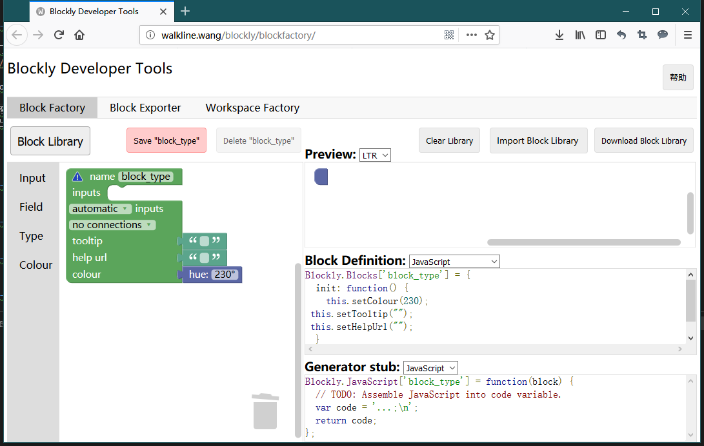

使用该模板项目 [webduino-blockly-template](https://github.com/BPI-STEAM/webduino-blockly-template) ，并将它的代码通过 download 或 clone 得到它。

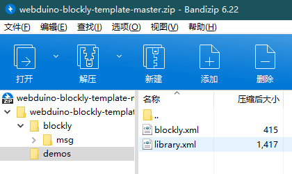

将文件里的 demo/library.xml 导回积木设计器，参考已有积木，重新设计出属于你的积木。

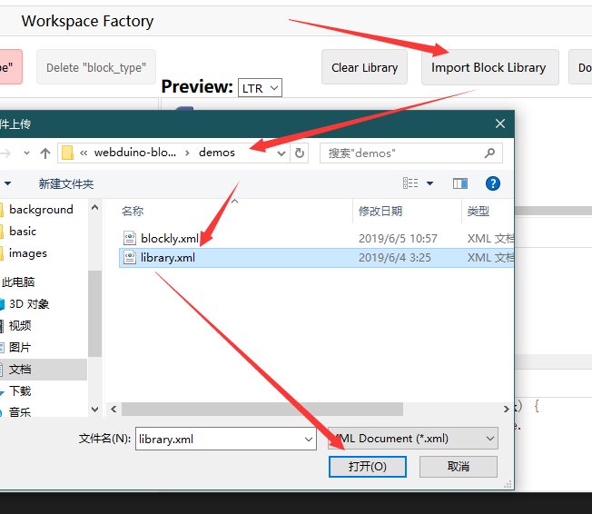

可以看到有如下积木类型。

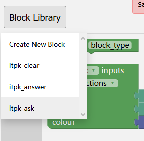

让我们点开一个 itpk_answer 看看都是如何定义的。

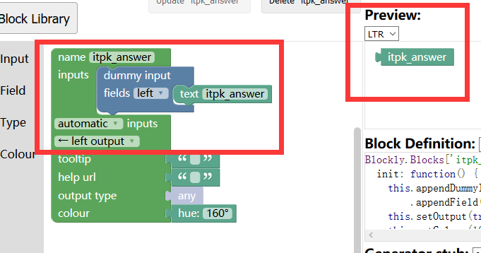

可以看到，左侧是积木编辑工具，右侧则是生成的结果：

- 积木外观样式预览（Preview）
- 积木外观定义代码（Block Definition）
- 代码生成函数桩（Generator stub）

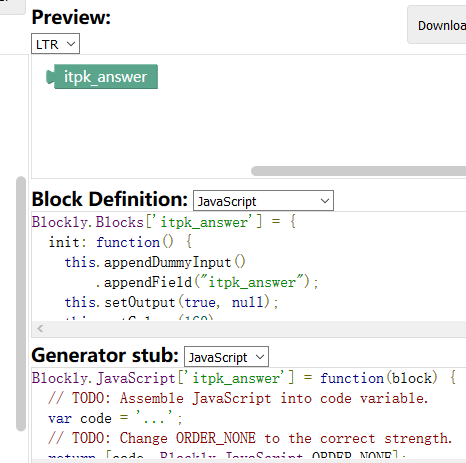

现在知道有这些东西就行，回头就会用上，至少知道这些代码都是使用该工具生成的。

## 设计新的积木

如果我们想做一个新的功能积木，可以建立在已有的基础上，比如参考一个已经存在的积木，将其修改成我们想要的样子，再封装成其他功能，拿查询本机 IP 的积木来举例，如果要在 itpk_ask 的基础上修改的话，那么积木应该长怎样呢？

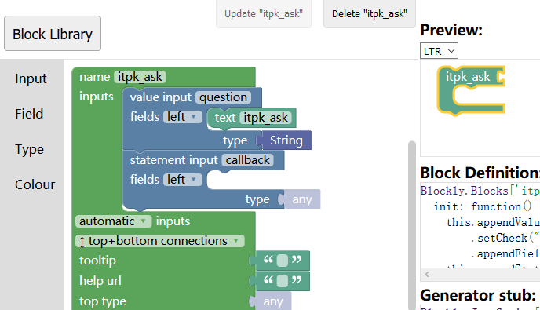

我们可以参考 itpk_ask 的积木设计，修改它直接变成我们想要的祥子，拖动一个无参数的积木连接块，如下图。

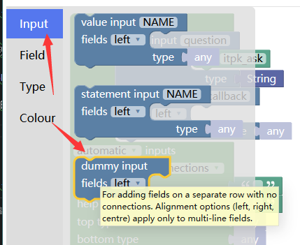

拖拽出来，放到和其他 Input 一样的地图，并且复制一下字符串对应过来，如下图。

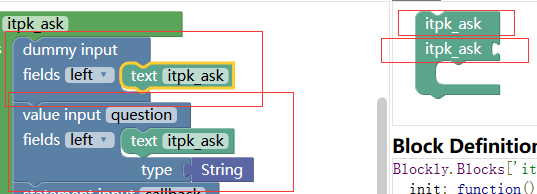

经过对比后可以发现 dummy input 不能再结合，所以看到的末尾是无法衔接其他模块的，此时我们将它设计成查 IP 的积木，如下图修改。（移除 value input 并编辑 text itpk_ask 积木块）

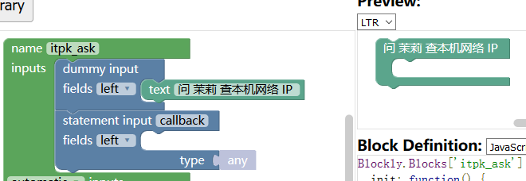

我们最后来改个名字并保存一下新的积木块，免得弄丢了，如下图。

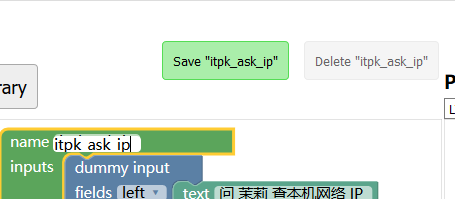

现在积木就设计完成了，但我们需要看，它对应的样式代码是怎样的才能放入我们的 Webduino Blockly 当中，所以看 Block Definition 的代码。

```javascript
Blockly.Blocks['itpk_ask_ip'] = {
  init: function() {
    this.appendDummyInput()
        .appendField("问 茉莉 查本机网络 IP ");
    this.appendStatementInput("callback")
        .setCheck(null);
    this.setPreviousStatement(true, null);
    this.setNextStatement(true, null);
    this.setColour(160);
 this.setTooltip("");
 this.setHelpUrl("");
  }
};
```

以上就是你所见到的积木它的定义代码，可以理解为是这段代码描述了积木的样子，也就是说，你也可以不通过 Blockly 设计器来修改积木外观，以及它对应的需要用户实现的桩代码：

```javascript
Blockly.JavaScript['itpk_ask_ip'] = function(block) {
  var statements_callback = Blockly.JavaScript.statementToCode(block, 'callback');
  // TODO: Assemble JavaScript into code variable.
  var code = '...;\n';
  return code;
};
```

这个函数可以为积木提供背后生成的代码环境，例如将 `var code = 'var test = 123;\n';` 这样就表示，这个积木块拖拽出来将提供 `var test = 123;\n` 的代码，也就是所谓的积木生成代码，积木块对应着代码，接下来我们就要将其导入我们的原本的积木当中。

## 添加新的积木

先前我们制作了一个积木块，我们需要将它添加到我们自己的积木里，先看一下我们想要添加的积木的效果。

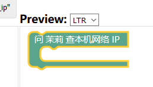

进入 Block Exporter 可以批量选取积木并导出对应代码。

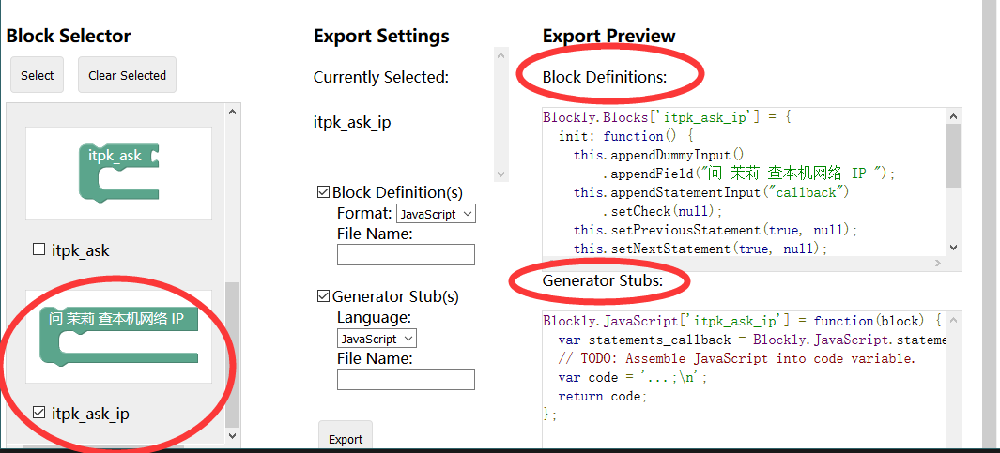

获取这两段定义内容，然后将它添加到创建的模板积木中，注意结合前一章的目录下的文件描述。

进入 blockly/blocks.js ，在后面添加 Block Definitions 的代码。

```javascript
Blockly.Blocks['itpk_ask_ip'] = {
  init: function() {
    this.appendDummyInput()
        .appendField("问 茉莉 查本机网络 IP ");
    this.appendStatementInput("callback")
        .setCheck(null);
    this.setPreviousStatement(true, null);
    this.setNextStatement(true, null);
    this.setColour(160);
 this.setTooltip("");
 this.setHelpUrl("");
  }
};
```

进入 blockly/javascript.js 也同样添加 Generator Stubs 的代码。

```javascript
Blockly.JavaScript['itpk_ask_ip'] = function(block) {
  var statements_callback = Blockly.JavaScript.statementToCode(block, 'callback');
  // TODO: Assemble JavaScript into code variable.
  var code = '...;\n';
  return code;
};
```

如果不清楚如何操作的可以看这个提交 [添加积木的定义](https://github.com/junhuanchen/webduino-blockly-template/commit/8f556c70a033d4e8186439dbf348d10aa29fece0) 。

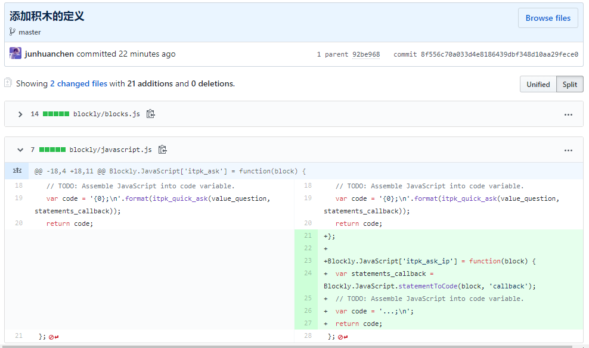

当你添加完了积木的定义，不代表积木可以使用，还需要在 blockly/toolbox.xml 中添加你积木的工具栏位置，否则将无法显示到左侧来，例如下图的效果。

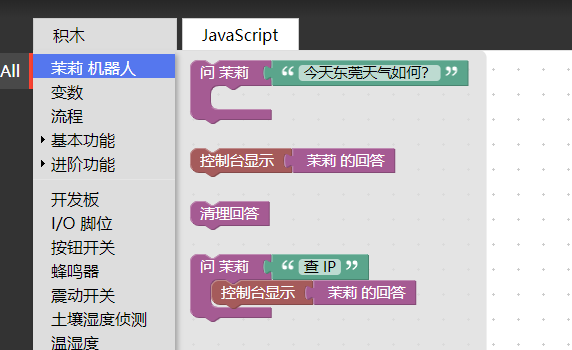

那么我们应该如何做呢？先是进入 Workspace Factory 可以模拟设计的积木大致的使用方法，与其他积木进行对接的尝试，还可以导出（Export）积木工具列 toolbox.xml 文件供你参考。


然后拿我们设计的积木出来。


此时通过下图的方式得到 toolbox.xml 文件，然后添加到我们原本的 blockly/toolbox.xml 文件当中。

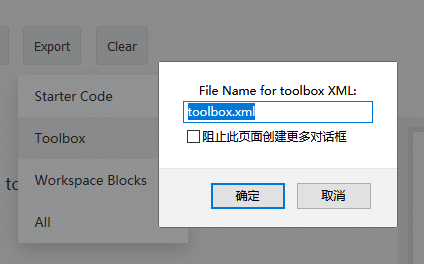

下载打开它得到 xml 文件代码。

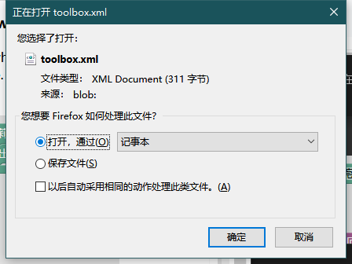

```xml
<xml xmlns="http://www.w3.org/1999/xhtml" id="toolbox" style="display: none;">
  <block type="itpk_ask_ip">
    <statement name="callback">
      <block type="text_print">
        <value name="TEXT">
          <block type="itpk_answer"></block>
        </value>
      </block>
    </statement>
  </block>
</xml>
```

实际上就可以看出积木的对应效果，例如 `<block>` 标签对应的就是积木块， `<statement>` 标签对应的就是结合的积木块，所以我们可以在工具栏看到如下效果。

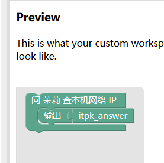

现在将其添加到我们的原本的模板积木当中，与其他存在的积木块作出对比。

以下是原内容：

```xml
<category id="catItpk">
  <block type="itpk_ask">
    <value name="question">
      <block type="text">
        <field name="TEXT">今天东莞天气如何？</field>
      </block>
    </value>
  </block>
  <block type="console">
    <value name="console">
      <block type="itpk_answer"></block>
    </value>
  </block>
  <block type="itpk_clear">
  </block>
  <block type="itpk_ask">
  <value name="question">
    <block type="text">
      <field name="TEXT">查 IP </field>
    </block>
  </value>
	<statement name="callback">
	<block type="console">
	<value name="console">
		<block type="itpk_answer"></block>
	</value>
	</block>
	</statement>
  </block>
</category>
```

在后面添加新内容，变成如下代码。

```xml
<category id="catItpk">
  <block type="itpk_ask">
    <value name="question">
      <block type="text">
        <field name="TEXT">今天东莞天气如何？</field>
      </block>
    </value>
  </block>
  <block type="console">
    <value name="console">
      <block type="itpk_answer"></block>
    </value>
  </block>
  <block type="itpk_clear">
  </block>
  <block type="itpk_ask">
  <value name="question">
    <block type="text">
      <field name="TEXT">查 IP </field>
    </block>
  </value>
	<statement name="callback">
	<block type="console">
	<value name="console">
		<block type="itpk_answer"></block>
	</value>
	</block>
	</statement>
  </block>
  <block type="itpk_ask_ip">
    <statement name="callback">
      <block type="console">
        <value name="console">
          <block type="itpk_answer"></block>
        </value>
      </block>
    </statement>
  </block>
</category>
```

现在，你已经将自己设计的积木添加进去了，此时你还需要最后一步，就可以载入积木看到效果。

在 blockly.json 中添加你的积木类型（types），因为它是一个全新的积木所以需要添加进去，否则不会被载入到动态积木中。

查看 blockly.json 的内容，然后在 types 列中添加 `"itpk_ask_ip",`

```json
{
  "types": [
    "itpk_ask_ip",
    "itpk_ask",
    "itpk_answer",
    "itpk_clear"
  ],
  "category": "itpk",
  "scripts": [
    "https://cdn.jsdelivr.net/gh/yarrem/stringFormat.js/format.js",
    "itpk-blockly.js",
    "blockly/blocks.js",
    "blockly/javascript.js"
  ],
  "dependencies": [
    "itpk.js"
  ],
  "msg": "blockly/msg",
  "blocksMsg": "blockly/msg/blocks",
  "toolbox": "blockly/toolbox.xml"
}
```

> 以下的操作均在浏览器无痕模式下进行。（等你足够了解后，可以先移除积木后刷新再重新载入积木）。

现在你可以提交它，然后等一会提交成功后，可以载入 `https://junhuanchen.github.io/webduino-blockly-template/blockly.json` 积木查看效果了。


## 代码生成测试

我们已经能够将自己设计的积木导入积木工具了，但还没有配合积木生成的代码，比如像下面这样，左边是积木，右边是代码。


我们需要知道积木生成代码的在 blockly/javascript.js 中有这样的 Generator Stubs 的代码。

```javascript
Blockly.JavaScript['itpk_ask_ip'] = function(block) {
  var statements_callback = Blockly.JavaScript.statementToCode(block, 'callback');
  // TODO: Assemble JavaScript into code variable.
  var code = '...;\n';
  return code;
};
```

在 Webduino Blockly 中点击 JavaScript 就会这样显示出来，如下图所示。

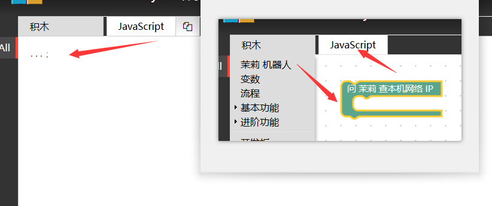

可以看到，它实际上就对应 `var code = '...;\n';` 的返回值，所以我们只需要修改这部分内容。

比如说，将其修改成 `var code = 'console.log("hello");\n';` 这就意味着，当你拖出这个代码将会得到 `console.log("hello");\n` 代码，让我们来试试修改 blockly/javascript.js 。

```javascript
Blockly.JavaScript['itpk_ask_ip'] = function(block) {
  var statements_callback = Blockly.JavaScript.statementToCode(block, 'callback');
  // TODO: Assemble JavaScript into code variable.
  var code = 'console.log("hello");\n';
  return code;
};
```

此时效果图如下，提交后重新载入积木即可看到效果。

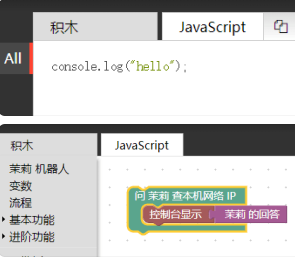

此时你会注意到，明明我们的积木中有 控制台显示 茉莉 的回答 ，但是代码中并没有，那该如何显示出来？看下面代码的 `console.log(statements_callback);` 的内容，然后继续添加。

```javascript
Blockly.JavaScript['itpk_ask_ip'] = function(block) {
  var statements_callback = Blockly.JavaScript.statementToCode(block, 'callback');
  // TODO: Assemble JavaScript into code variable.
  
  console.log(statements_callback);

  var code = 'console.log("hello");\n';
  return code;
};
```

这时候就意味着 F12 的开发者调试工具的控制台，可以看到如下效果，也就是你所包含的代码内容，掌握了这个方法后，就可以调试积木代码生成的情况了。

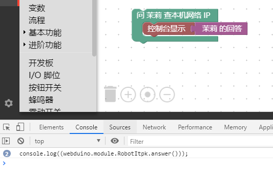

当你查看代码的时候，它将会生成 控制台显示 茉莉 的回答 的效果，但这个做法只是了解一下现象，并不推荐在这里修改，因为设计器会重新生成代码，所以要减少该部分代码，全部采用外部函数调用的方法，那么我们如果想要轻松的添加自己的积木代码，请参考 itpk-blockly.js 是怎么写的。

举个例子，看 `itpk_answer` 的积木定义，它调用了 `itpk_answer();` 函数。

```javascript
Blockly.JavaScript['itpk_answer'] = function(block) {
  // TODO: Assemble JavaScript into code variable.
  var code = itpk_answer();
  // TODO: Change ORDER_NONE to the correct strength.
  return [code, Blockly.JavaScript.ORDER_NONE];
};
```

而这个函数就被实现在  itpk-blockly.js 中，也就是如下代码。

```javascript
scope.itpk_answer = function () {
  return "webduino.module.RobotItpk.answer()";
}
```

所以在得到设计器的代码后，只需要将  `var code = '...;\n';` 修改成 `var code = itpk_answer();` ，极大的减少了设计器的代码变动。

我们继续看另一个例子。

```javascript
Blockly.JavaScript['itpk_ask'] = function(block) {
  var value_question = Blockly.JavaScript.valueToCode(block, 'question', Blockly.JavaScript.ORDER_ATOMIC);
  var statements_callback = Blockly.JavaScript.statementToCode(block, 'callback');
  // TODO: Assemble JavaScript into code variable.
  var code = '{0};\n'.format(itpk_quick_ask(value_question, statements_callback));
  return code;
};
```

它就是 `itpk_ask` 积木的例子，只需要注意到这行代码。

```javascript
var code = '{0};\n'.format(itpk_quick_ask(value_question, statements_callback));
```

其他都是设计器自动生成的，解释一下 `itpk_quick_ask` 的实现过程。

```javascript
scope.itpk_quick_ask = function (question, callback) {
  return "webduino.module.RobotItpk.quick_ask({0}, function(){\n  {1}})".format(question, callback);
}
```

在 blockly/itpk-blockly.js 我们看到类似 `"{0}-{1}".format(1, 2)` 的操作，这个操作是将代码进行格式化，可以帮助生成代码的格式化输入，提供字符串的封装方法，而不是 "1" + "-" + "2" 的方式，例如下述代码。

```javascript
scope.itpk_quick_ask = function (question, callback) {
  return "webduino.module.RobotItpk.quick_ask(" + question + ", function(){\n  " + callback + "})";
}
```

不建议写出以上字符串拼装代码，因为积木设计大量充斥这种字符串相互包含的关系，Code 会显得非常 Ugly ，所以使用这样的方式去开发你的积木对应的代码吧。

## 添加对应功能

现在积木已经生成，但是我们要如何为如下代码添加对应的功能呢？

```javascript
scope.itpk_answer = function () {
  return "webduino.module.RobotItpk.answer()";
}
```

我们继续看它的生成代码，这个实际上就是生成（返回）一段调用 blockly/itpk-blockly.js 函数的 `webduino.module.RobotItpk.answer()` 代码，所以我们需要在 blockly/itpk-blockly.js 中提供这个函数的实现，也就是如下代码。

```javascript
RobotItpk.answer = function () {
    return answer.replace("[cqname]", "moli");
}
```

我们可以在单元测试（unit_test）中得知它的用法。

```javascript
function unit_test() {
  webduino.module.RobotItpk.ask('东莞天气如何？');
  setTimeout(function(){
    console.log(webduino.module.RobotItpk.answer());
    webduino.module.RobotItpk.ask('高雄天气如何？');
    setTimeout("console.log(webduino.module.RobotItpk.answer())", 1000);
  }, 1000);
}
```

但是为什么可以链接起来？这需要看 blockly.json 的定义。

```javascript
{
  "types": [
    "itpk_ask_ip",
    "itpk_ask",
    "itpk_answer",
    "itpk_clear"
  ],
  "category": "itpk",
  "scripts": [
    "https://cdn.jsdelivr.net/gh/yarrem/stringFormat.js/format.js",
    "itpk-blockly.js",
    "blockly/blocks.js",
    "blockly/javascript.js"
  ],
  "dependencies": [
    "itpk.js"
  ],
  "msg": "blockly/msg",
  "blocksMsg": "blockly/msg/blocks",
  "toolbox": "blockly/toolbox.xml"
}
```

关于依赖的 javascript 代码的使用情况，我们需要将 Blockly 分成两个场景，第一是积木生成代码阶段的，第二是生成代码的时候运行依赖，也就是 `scripts` 和 `dependencies` 两列，如你所见的是 `scripts` 包含的是 Blockly 积木相关联的实现代码，而 `dependencies` 则是代码运行的时候依赖的 javascript 代码，例如 `itpk.js` 代码可以在运行代码的时候实现。

## 积木功能测试

当我们知道了如何添加自己的功能代码，就要脱离这个 Blockly 生产环境来测试我们的代码了，在开发环境中，分本地和在线测试运行代码，需要注意的是，本地测试的代码具备一定的特殊性，比如没办法依赖 Webduino 中提供的其他功能，例如无法使用 webduino.module 这个模块变量。

### 本地测试积木功能

所以在本地写经典代码时，一般需要单独测试和移植，例如下面的茉莉机器人 API 的测试代码 `itpk.html` 。

```javascript
<!DOCTYPE html>
<html>

<head>
    <meta charset="utf-8">
    <title>茉莉机器人 API 测试</title>
    <script src="https://code.jquery.com/jquery-3.3.1.min.js"></script>
</head>

<body>
    <script>
        AskItpk = function (question) {
            $.post("http://i.itpk.cn/api.php", {
                'question': question
            }, function (data) {
                console.log("数据：" + data);
            });
        }
        AskItpk('东莞天气如何？');
    </script>
</body>

</html>
```

> 代码无高低，能用就行。

通过这样的方式再转换改写成 `itpk.js` 的模块结构代码，看如下代码。

```javascript
+(function (factory) {
    if (typeof exports === 'undefined') {
        factory(webduino || {});
    } else {
        module.exports = factory;
    }
}(function (scope) {
    'use strict';
  
    const url = "https://i.itpk.cn/api.php";
    var answer = "";

    function RobotItpk() {
        Module.call(this);
    }

    RobotItpk.ask = function (question) {
        $.post(url, {
            'question': question
        }, function (respond) {
            // console.log(data);
            answer = respond;
        });
    }
    
    RobotItpk.clear = function () {
        answer = "";
    }
    
    RobotItpk.answer = function () {
        return answer.replace("[cqname]", "moli");
    }

    RobotItpk.quick_ask = function (question, callback) {
        $.post(url, {
            'question': question
        }, function (respond) {
            answer = respond
            callback();
        });
    }

    scope.module.RobotItpk = RobotItpk;

}));

function unit_test() {
  webduino.module.RobotItpk.ask('东莞天气如何？');
  setTimeout(function(){
    console.log(webduino.module.RobotItpk.answer());
    webduino.module.RobotItpk.ask('高雄天气如何？');
    setTimeout("console.log(webduino.module.RobotItpk.answer())", 1000);
  }, 1000);
  
}

// unit_test();

```

但你也可以直接使用 AMD JS 代码的方式，规范的模块化整合到积木环境中，这就需要你具备一定的现代  JS 代码模块规范的基础，可以先了解 [webpack-demo](https://github.com/BPI-STEAM/webpack-demo) 或配合这个示例项目 [webpack-develop-example](https://github.com/BPI-STEAM/webpack-develop-example) 来操作，这将有利于你写出规范的专业代码，就像下面这样的代码直接编译运行在浏览器，这将高度符合 Webduino Blockly 的运行环境。

```javascript
(function (root, factory) {
    if (typeof define === 'function' && define.amd) {
        // AMD
        define(['jquery'], factory);
    } else if (typeof exports === 'object') {
        // Node, CommonJS etc
        module.exports = factory(require('jquery'));
    } else {
        // Browser global variable (root is window)
        root.returnExports = factory(root.jQuery);
    }
}(this, function ($) {

    'use strict';

    const url = "https://i.itpk.cn/api.php";
    var answer = "";

    var proto;

    var RobotItpk = function () {

    };

    RobotItpk.prototype = proto = Object.create({
        constructor: {
            value: RobotItpk
        }
    });

    proto.ask = function (question) {
        $.post(url, {
            'question': question
        }, function (respond) {
            console.log(respond);
            answer = respond;
        });
    }

    proto.clear = function () {
        answer = "";
    }

    proto.answer = function () {
        return answer.replace("[cqname]", "moli");
    }

    proto.quick_ask = function (question, callback) {
        $.post(url, {
            'question': question
        }, function (respond) {
            console.log(respond);
            answer = respond
            callback();
        });
    }

    window.RobotItpk = RobotItpk;

}));

var ts = new window.RobotItpk();
ts.ask("nihao");

setTimeout(function () {
    document.write('<h1>' + ts.answer() + '</h1>');
}, 1000);
```

### 在线测试积木功能

我们可以在积木的时候里面进行代码的查看，如下图操作。

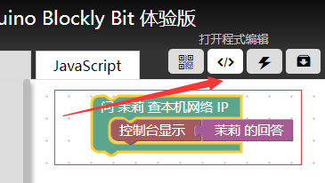

如你所见，可以在这里进行代码的运行以及调试。

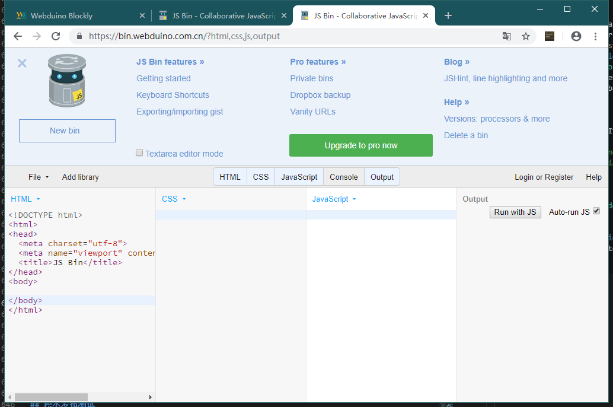

[JS bin](https://bin.webduino.com.cn/?html,css,js,output) 是一款在线编写浏览器 JS 工具，可以在这里进行你的调试于测试，比如我们可以这样做，将 itpk-blockly.js 或 itpk.js 文件代码放入下图所述位置，即可自动运行输出。


> 上图需要你点开 Console 控制台输出 debug 信息，并且粘贴 itpk.js 代码后拉到低下取消 unit_test() 的注释，从而运行单元测试，默认修改代码自动运行。

## 添加积木语言

最后积木制作出来后，为了与国际化接轨，我们还需要为积木添加多语言，但这一步需要修改 blocks.js 设计器生成代码，连接多语言变量的定义，所以请确保该积木已经相对稳定后再添加多语言功能。

我们拿内部例子来举例，例如 blockly/msg/en.js 文件中的内容。

```javascript
MSG.catItpk = 'Itpk Robot';
```

这实际上就对应着

## 积木发布测试

 